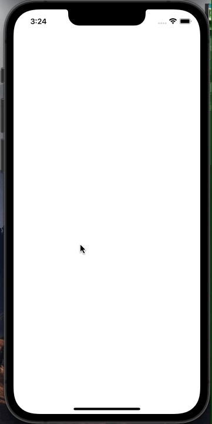
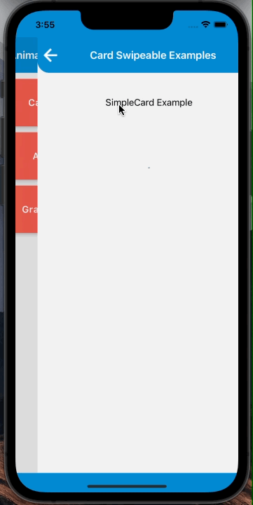

# react-native-animation-catalog
-------------
This library contains animated components such as ```AnimatedList```, ```Swipeable Card``` and ```Gradient Progress```.
* In many react-native projects we have worked on, the component/content of the FlatList is required to be rendered with animation. Here, The ```AnimatedList``` component provides us several animation which can be directly utilized to render animation.
* Other components are ```Swipeable Card``` and ```Gradient Progress``` which are used respectively when user swipe or click on button, the card will remove from the UI based on some animation and when app is processing something, so the user can be made aware of app doing some processing.

### Working Samples
----
AnimatedList Example One              |  AnimatedList Example Two
:-------------------------:|:-------------------------:
|

Swipeable Card Example One              |  Swipeable Card Example Two
:-------------------------:|:-------------------------:
|

---
### Ⅰ. [Animated List](./src/components/AnimatedList)
[More about AnimatedList component](./src/components/AnimatedList/README.md)

---
### ⅠI. [Swipeable Card](./src/components/CardSwipeable)
[More about Swipeable component](./src/components/CardSwipeable/README.md)

---
### ⅠII. [Gradient Progress](./src/components/GradientProgress)
[More about Gradient Progress component](./src/components/GradientProgress/README.md)

---

### Example
A full working example project is here [Example](./example/)
```sh
$ yarn
$ yarn example ios   // For ios
$ yarn example android   // For Android
```

### License
* [MIT License](./LICENSE)

