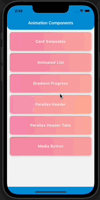
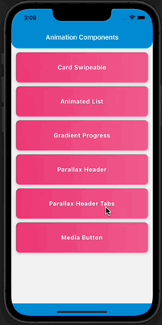
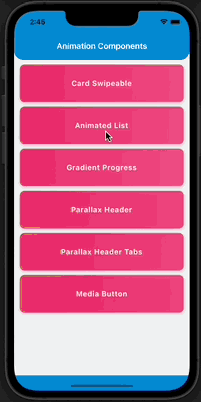

# react-native-animation-catalog

---

## [](https://www.npmjs.org/package/react-native-animation-catalog) [](https://www.android.com) [](https://developer.apple.com/ios) [](https://opensource.org/licenses/MIT)

<br>

This custom animated component library provides multiple custom animated components like `AnimatedList`, `AnimatedCard`, `GradientProgress`, `ParallaxHeader`, `MediaButton`.

- It also provides an example app and a detailed usage overview of every available component
- All the available components are fully Android and iOS compatible.
- See our available <a href="#Components">Components</a>

## 🎬 Preview

---

|   <div style="width:270px"></div>Parallax Header   | <div style="width:270px"></div>Parallax Header (With-Tabs) | <div style="width:270px"></div>AnimatedList |
| :------------------------------------------------: | :--------------------------------------------------------: | :-----------------------------------------: |
|  |                 |  |

| <div style="width:270px"></div>Gradient Progress | <div style="width:270px"></div>Animated Card | <div style="width:270px"></div>Media Button |
| :----------------------------------------------: | :------------------------------------------: | :-----------------------------------------: |
|         |         |         |

## Installation

##### 1. Install animation catalog

```bash
$ npm install react-native-animation-catalog
# --- or ---
$ yarn add react-native-animation-catalog
```

##### 2. Install required dependencies

```bash
$ npm install react-native-reanimated react-native-gesture-handler react-native-linear-gradient @react-navigation/native @react-navigation/material-top-tabs react-native-tab-view react-native-pager-view react-native-screens react-native-safe-area-context
# --- or ---
$ yarn add react-native-reanimated react-native-gesture-handler react-native-linear-gradient @react-navigation/native @react-navigation/material-top-tabs react-native-tab-view react-native-pager-view react-native-screens react-native-safe-area-context
```

##### 3. Install cocoapods in the ios project

```bash
cd ios && pod install
```

> Note: Make sure to add Reanimated's babel plugin to your `babel.config.js`

```
module.exports = {
      ...
      plugins: [
          ...
          'react-native-reanimated/plugin',
      ],
  };
```

## Components

---

### Ⅰ. [Animated List](./src/components/AnimatedList)

[More about AnimatedList component](./src/components/AnimatedList/README.md)

---

### ⅠI. [Animated Card](./src/components/AnimatedCard)

[More about AnimatedCard component](./src/components/AnimatedCard/README.md)

---

### ⅠII. [Gradient Progress](./src/components/GradientProgress)

[More about Gradient Progress component](./src/components/GradientProgress/README.md)

---

### ⅠV. [Parallax Header](./src/components/ParallaxHeader)

[More about Parallax Header component](./src/components/ParallaxHeader/README.md)

---

### V. [Media Button](./src/components/MediaButton)

[More about Media Button component](./src/components/MediaButton/README.md)

---

### Example

A full working example project is here [Example](./example/)

```sh
$ yarn
$ yarn example ios   // For ios
$ yarn example android   // For Android
```

## Find this library useful? ❤️

Support it by joining [stargazers](https://github.com/SimformSolutionsPvtLtd/react-native-animation-catalog/stargazers) for this repository.⭐

## 🤝 How to Contribute

We'd love to have you improve this library or fix a problem 💪
Check out our [Contributing Guide](CONTRIBUTING.md) for ideas on contributing.

## Bugs / Feature requests / Feedbacks

For bugs, feature requests, and discussion please use [GitHub Issues](https://github.com/SimformSolutionsPvtLtd/react-native-animation-catalog/issues)

### License

- [MIT License](./LICENSE)
